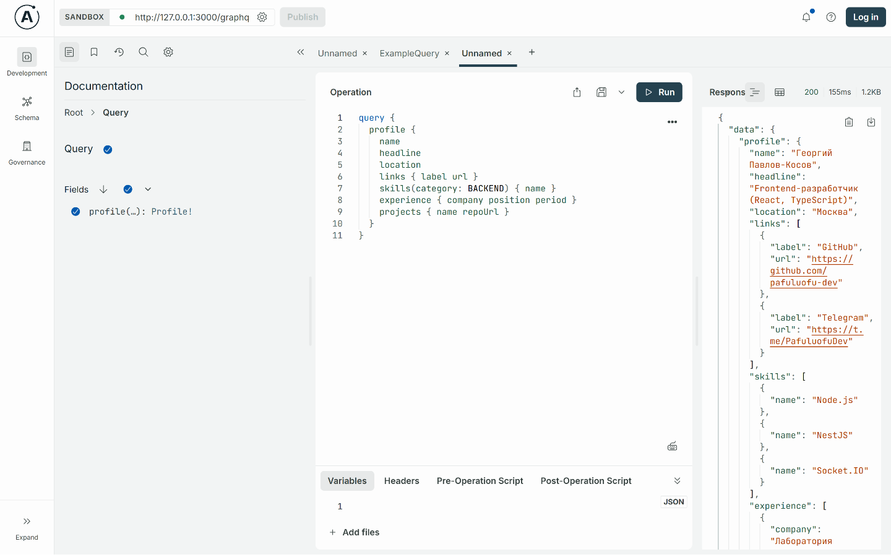

# Цифровая визитка (GraphQL API)

Бэкенд-визитка: профиль, ссылки, навыки, опыт работы и проекты отдаются через GraphQL.
Тестовое задание на должность «TypeScript-разработчик (backend)».

TypeScript, NestJS, GraphQL (Apollo Server), Prisma, PostgreSQL, Docker.



## Запуск в Docker

Кроме Docker ничего не нужно.

```bash
git clone https://github.com/pafuluofu-dev/business-card-api.git
cd business-card-api
docker compose up --build
```

Поднимутся PostgreSQL и приложение. Миграции накатываются перед стартом приложения, данные
визитки заливаются в базу при инициализации — руками делать ничего не надо.

Apollo Sandbox: http://localhost:3000/graphql — с корня туда же редирект.

## Запуск без Docker

Нужны Node.js 22+ и PostgreSQL.

```bash
npm ci
cp .env.example .env     # в DATABASE_URL — своя база
npm run db:migrate
npm run start:dev
```

## Запрос

```graphql
query {
  profile {
    name
    description
    skills {
      name
    }
    experience {
      company
      position
    }
    projects {
      name
    }
  }
}
```

Навыки можно попросить по группе, у опыта есть готовая строка периода:

```graphql
query {
  profile {
    name
    links {
      label
      url
    }
    skills(category: BACKEND) {
      name
    }
    experience {
      company
      position
      period
      achievements
    }
    projects {
      name
      repoUrl
      demoUrl
    }
  }
}
```

Вся схема — в [schema.gql](schema.gql), она генерируется из кода при старте.

## Как устроено

```
src/
  config/     разбор и проверка переменных окружения (zod)
  prisma/     PrismaService: подключение к базе и его жизненный цикл
  profile/    GraphQL: типы, резолверы и сервис с запросами
  seed/       содержимое визитки и его заливка при старте
  health/     GET /health для healthcheck контейнера
prisma/       схема базы и миграции
```

Резолверы только разбирают запрос и зовут `ProfileService`, все обращения к базе живут в нём.
GraphQL-типы (`src/profile/entities`) описаны отдельно от моделей Prisma: наружу торчит схема,
а не структура таблиц.

## Решения, которые стоит пояснить

**Базу наполняет приложение, а не `prisma db seed`.** Миграции накатывает entrypoint контейнера
(`prisma migrate deploy`), данные заливает `SeedService` на старте приложения — одинаково и
локально, и в Docker, и на хостинге, где отдельную команду сидов запустить негде. Заливка
идемпотентна: профиль upsert-ится по `slug`, вложенные записи переписываются целиком, так что
база всегда равна содержимому `src/seed/profile.content.ts`. Отключается через `SEED_ON_START=false`.

**Вложенные списки — отдельные резолверы, а не один `include`.** На `{ profile { name } }` в базу
уйдёт один запрос, навыки и проекты подтянутся, только если их спросили. Профиль в базе один, так
что N+1 тут взяться неоткуда и DataLoader не нужен: максимум пять запросов на любой запрос схемы.

**`period` считается в резолвере, а не хранится строкой.** В базе лежат даты начала и конца
(`DATE`), а «сентябрь 2024 — сентябрь 2026» собирается на лету — незакрытый период сам
превращается в «настоящее время».

**`prisma` и `dotenv` лежат в dependencies.** Контейнер накатывает миграции сам при старте, значит
CLI нужен в рантайм-образе, а не только при сборке.

## Тесты

```bash
npm test          # юниты: сервис профиля и формат периода
npm run test:e2e  # поднимает приложение и дёргает GraphQL, вместо базы — заглушка
```

## Переменные окружения

| Переменная      | По умолчанию | Зачем                                        |
| --------------- | ------------ | -------------------------------------------- |
| `DATABASE_URL`  | —            | Строка подключения к PostgreSQL, обязательна |
| `PORT`          | `3000`       | Порт приложения                              |
| `SEED_ON_START` | `true`       | Заливать ли визитку в базу при старте        |

Если переменные не проходят проверку, приложение не стартует и пишет в лог, что именно не так.
